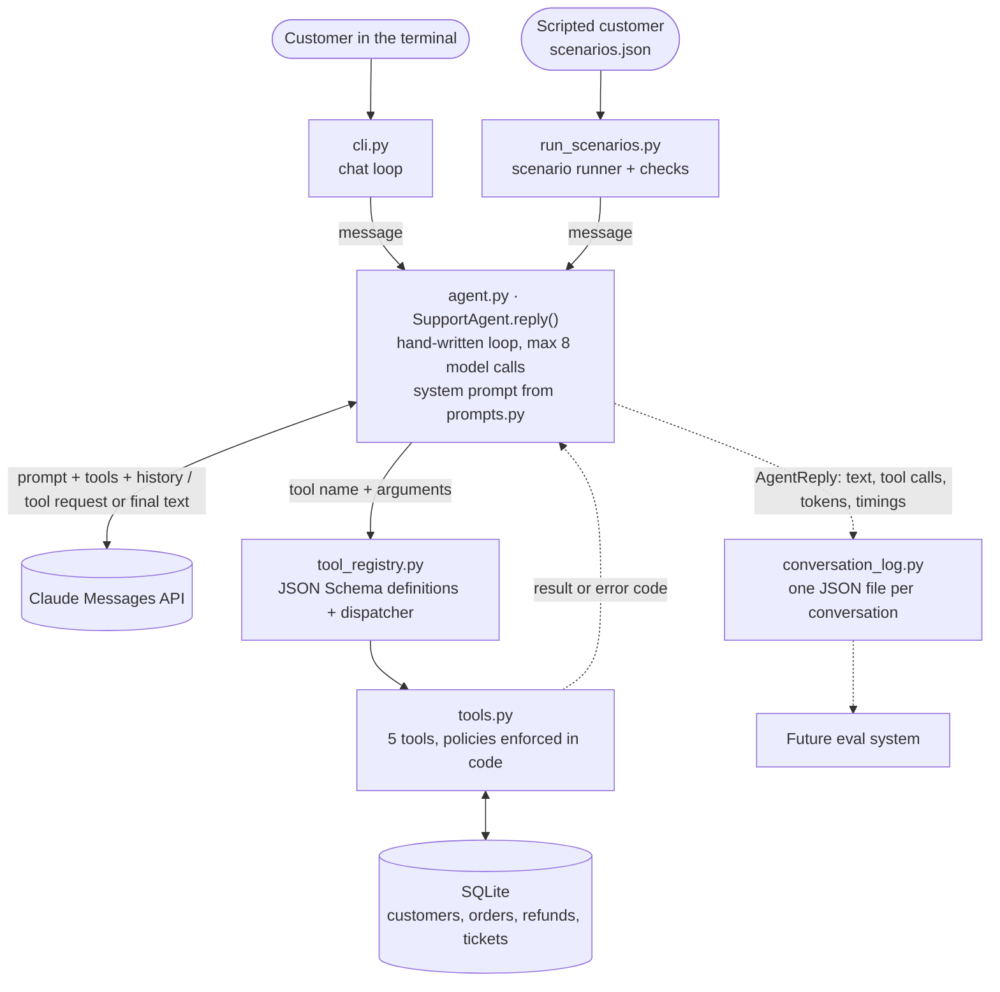
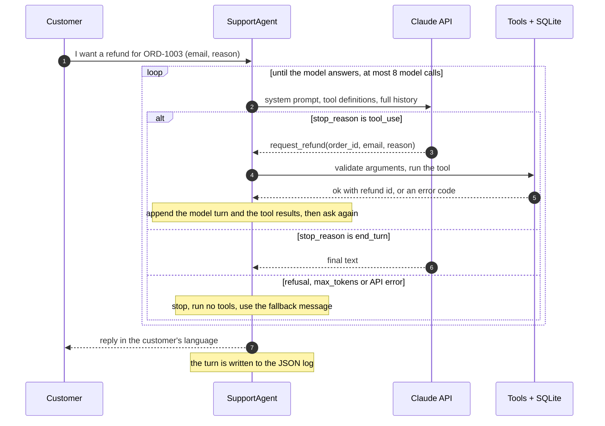

# Multilingual Support Agent

A customer support AI agent for a fictional online store, Kumo Market. It chats in Spanish, Japanese and English, and uses tools to look up orders, change shipping addresses, request refunds, open support tickets and hand a conversation to a human.

The agent loop is written by hand on top of the Claude API, with no agent framework, so every step is visible in about 250 lines of Python: the model decides, a tool runs, the result goes back, and it repeats until there is an answer.

```text
You> 注文ORD-1004のモニターを返金してほしいです。メールはken.sato@example.jpです。画面にドット抜けがあります。
  [tool] request_refund {"order_id": "ORD-1004", "email": "ken.sato@example.jp", "reason": "The monitor has dead pixels on the screen."} -> error: refund_window_expired
  [2 model call(s), 5.1 s, 5093 tokens in / 313 out, stop: end_turn]
Agent> ご連絡ありがとうございます。ドット抜けがあるとのこと、ご不便をおかけして申し訳ありません。

ORD-1004を確認したところ、お届けから45日が経過しており、返金のお申し込み期限(お届けから30日、2026年9月21日)を過ぎているため、返金をリクエストすることができませんでした。

私のほうでは期限の例外を設けることはできませんが、ご希望でしたら担当スタッフに引き継ぎ、状況を確認してもらうことができます。引き継ぎを希望されますか?
```

The customer writes in Japanese, the internal refund reason is recorded in English for the support team, the 30-day policy is enforced by the tool rather than by the model, and the agent offers a human instead of promising an exception.

## What it does

- **Answers in the customer's language** (Spanish, Japanese or English) and follows them if they switch.
- **Verifies identity** with order number plus email before sharing or changing anything about an order.
- **Acts through five tools** backed by a simulated SQLite store, each with its policy check in code.
- **Refuses what policy does not allow** (late refunds, address changes after shipping) and does not promise exceptions.
- **Escalates to a human** when the customer asks, is very upset, or the tools do not cover the case.
- **Logs every conversation as structured JSON**: messages, tool calls with arguments and results, token usage and latency. The logs are designed as input for an evaluation system.
- **Ships with ten scripted scenarios** that run against the live API and report what happened.

## Architecture



The model never touches the database. It can only ask for a tool by name with arguments; the Python code decides whether and how to run it.

### One customer message, step by step



`SupportAgent.reply()` in [`support_agent/agent.py`](support_agent/agent.py) is that loop:

1. Send the full conversation, the system prompt and the tool definitions to the model. The API is stateless, so the history list is the agent's only memory.
2. If the model stops with `tool_use`, run every requested tool, append the model's turn and one message with all the results, and go back to step 1.
3. If it stops with `end_turn`, its text is the reply.
4. Anything else (`refusal`, `max_tokens`, an API failure, or reaching the iteration limit) ends the turn with a fixed fallback message, and no tool from an incomplete turn is ever run.

## Tools and policies

| Tool | What it does | Policy enforced in code |
| ---- | ------------ | ----------------------- |
| `get_order_status(order_id, email)` | Order status, dates, items and total | Email must match the order |
| `update_shipping_address(order_id, email, new_address)` | Changes the delivery address | Only while the order is `processing` |
| `request_refund(order_id, email, reason)` | Opens a refund request | Delivered orders, within 30 days of delivery, once per order |
| `create_support_ticket(email, summary)` | Opens a ticket for follow-up by email | Valid email required |
| `escalate_to_human(reason)` | Queues the conversation for a human agent | A reason is required |

Tools never raise for expected problems. They return `{"ok": false, "error_code": "...", "message": "..."}` with a stable code such as `order_not_found`, `email_mismatch`, `order_already_shipped` or `refund_window_expired`, so the model can explain the problem and the logs record exactly what happened.

## Getting started

Requires Python 3.10 or newer and an Anthropic API key.

```bash
python -m venv .venv
.venv\Scripts\activate          # Windows
# source .venv/bin/activate     # macOS / Linux
pip install -r requirements.txt
cp .env.example .env            # then add your ANTHROPIC_API_KEY
python -m support_agent.seed    # build the simulated store database
```

### Configuration

Everything is read from `.env`, which is git-ignored.

| Variable | Description |
| -------- | ----------- |
| `ANTHROPIC_API_KEY` | Your Anthropic API key. Never commit it. |
| `ANTHROPIC_MODEL` | Claude model the agent uses. The code never names a model; a test enforces it. |
| `ANTHROPIC_EFFORT` | Optional thinking effort (`low` to `max`). Empty uses the API default. |
| `AGENT_MAX_ITERATIONS` | Optional cap on model calls per customer message (default 8). |
| `GROQ_API_KEY` | Voice only. Free Groq key for speech-to-text (no card needed). |
| `STT_MODEL` | Voice only. Speech-to-text model hosted by Groq. |
| `TTS_VOICE_ES`, `TTS_VOICE_JA`, `TTS_VOICE_EN` | Voice only, optional. Replace the default text-to-speech voice of a language. |

### Chat

```bash
python -m support_agent
```

```text
You> Hi, I'd like a refund for the headphones I bought.
  [1 model call(s), 2.3 s, 2403 tokens in / 27 out, stop: end_turn]
Agent> I can help with that. Could you please give me your order number and the email address you used for the order?

You> The order is ORD-1003 and my email is emily.johnson@example.com. The right ear cup stopped working after a week.
  [tool] request_refund {"order_id": "ORD-1003", "email": "emily.johnson@example.com", "reason": "The right ear cup of the headphones stopped working after one week."} -> ok
  [2 model call(s), 4.7 s, 5141 tokens in / 223 out, stop: end_turn]
Agent> I'm sorry the headphones stopped working. I've opened a refund request for order ORD-1003.

Reference number: RF-0001
Amount: 199.00 USD

Our support team will review the request. I can't promise it will be approved or say when any money would arrive. Is there anything else I can help with?
```

The indented lines show what happened behind each reply: tool calls with their arguments and outcome, then model calls, time and tokens.

| Option | Effect |
| ------ | ------ |
| `--quiet` | Hide the tool, timing and token lines |
| `--reset-db` | Rebuild the simulated store first (order dates are relative to the day it is built) |
| `--log-dir PATH` | Save conversation logs somewhere other than `logs/` |

Inside the chat, `/new` starts a fresh conversation and `/exit` leaves.

Orders with a known state, useful for trying things out (all created by the seed script):

| Order | Email | State |
| ----- | ----- | ----- |
| `ORD-1001` | `yuki.tanaka@example.jp` | Processing (address can change) |
| `ORD-1002` | `maria.garcia@example.com` | Shipped |
| `ORD-1003` | `emily.johnson@example.com` | Delivered 10 days ago (refundable) |
| `ORD-1004` | `ken.sato@example.jp` | Delivered 45 days ago (refund window closed) |
| `ORD-1005` | `carlos.hernandez@example.com` | Cancelled |

### Voice chat

```bash
python -m support_agent --voice
```

Hold SPACE while you talk and release it to send. The agent's answer is printed and read aloud. `N` starts a new conversation, `Q` or `Esc` leaves. It needs a microphone, a free Groq key in `.env`, and Windows (the push-to-talk key reads the Windows key state).

```text
Listening... release SPACE to send.
You> Hola, quiero saber dónde está mi pedido. El número es ORD1002 y mi correo es maria.garcia.example.com.
  [tool] get_order_status {"order_id": "ORD-1002", "email": "maria.garcia@example.com"} -> ok
  [2 model call(s), 4.2 s, 6407 tokens in / 281 out, stop: end_turn]
Agent> Su pedido ya salió. Se envió el dos de octubre y todavía no se ha entregado. Va a la Calle de Alcalá cuarenta y cinco, en Madrid. Tiene un número de seguimiento, ¿quiere que se lo lea?
```

The `You>` line is what the speech recogniser understood, mistakes included: the order number lost its hyphen and the email its `@`. The agent works out the written form before calling the tool, and writes its answer for the ear: dates and amounts in words, no lists, long codes offered instead of recited.

It is the same agent as the text chat. Speech-to-text (Whisper on Groq's free tier) turns the recording into the text passed to `SupportAgent.reply()`, and text-to-speech (`edge-tts`) reads the reply with a voice native to the language the customer spoke. Both are free and sit behind small interfaces in [`support_agent/voice/speech.py`](support_agent/voice/speech.py).

### Unit tests

```bash
pytest
```

197 tests, no API key, microphone or network needed: the agent, the chat and the scenario runner are tested against a scripted fake client, and the tools against a small hand-written store.

## Conversation logs

Every conversation is saved to `logs/<timestamp>_<id>.json` and rewritten after each turn. The format is meant for automated evaluation:

```jsonc
{
  "schema_version": 1,
  "conversation_id": "20261006T191317Z_10dd59f6",
  "channel": "text",                    // how the customer reached the agent
  "model": "...", "effort": "medium", "max_iterations": 8,
  "system_prompt_sha256": "...",        // which prompt version produced this conversation
  "metadata": {},                       // free-form labels, e.g. a scenario name and its check results
  "totals": { "turns": 2, "model_calls": 3, "tool_calls": 1, "latency_ms": 8058, "usage": { ... } },
  "turns": [
    {
      "index": 1,
      "user_message": "...",
      "assistant_message": "...",
      "stop_reason": "end_turn",        // or max_iterations, refusal, max_tokens, api_error...
      "completed": true,
      "iterations": 2,
      "latency_ms": 4669,
      "usage": { "input_tokens": 6, "output_tokens": 277, "cache_creation_input_tokens": 301, "cache_read_input_tokens": 4880 },
      "error": null,
      "model_calls": [ { "iteration": 1, "stop_reason": "tool_use", "latency_ms": 1616, "usage": { ... } } ],
      "tool_calls": [
        { "iteration": 1, "id": "toolu_...", "name": "request_refund",
          "input": { "order_id": "ORD-1007", "email": "...", "reason": "..." },
          "result": { "ok": true, "refund_id": "RF-0001", "status": "requested" },
          "is_error": false, "latency_ms": 19 }
      ]
    }
  ],
  "transcript": [ ... ]                 // raw message history exactly as sent to the API
}
```

## Scenario tests

[`scenarios/scenarios.json`](scenarios/scenarios.json) holds ten scripted conversations. Each one is a list of customer messages plus a few expectations, and runs against the live API on a freshly seeded in-memory store.

| Scenario | Language | What it covers |
| -------- | -------- | -------------- |
| `es_order_status` | es | Happy path: order lookup |
| `ja_address_change` | ja | Happy path: address change before shipping |
| `en_refund_in_window` | en | Happy path: refund 10 days after delivery, details given in a second message |
| `ja_refund_window_expired` | ja | Out of policy: refund 45 days after delivery, then asking for an exception |
| `es_address_change_after_shipping` | es | Out of policy: address change after the order shipped |
| `en_someone_elses_order` | en | Privacy: another customer's order, then "it's my wife's order" |
| `es_asks_for_human` | es | Escalation: the customer asks for a person |
| `ja_upset_customer` | ja | Escalation: a very upset customer who did not ask for a person |
| `en_cancel_order_not_supported` | en | A request no tool covers (cancelling an order) |
| `es_wrong_order_number_then_corrected` | es | Recovery: a wrong order number, then the right one |

```bash
python -m support_agent.run_scenarios                    # run all ten
python -m support_agent.run_scenarios en_someone_elses_order
python -m support_agent.run_scenarios --list
```

The runner prints every conversation with its tool calls, then a summary, and exits with a non-zero code if any check failed. This is the summary of a run with `claude-sonnet-5-5` at `medium` effort:

```text
RESULT SCENARIO                                TOOLS (in order)
PASS   es_order_status                         get_order_status:ok
PASS   ja_address_change                       get_order_status:ok, update_shipping_address:ok
PASS   en_refund_in_window                     request_refund:ok
PASS   ja_refund_window_expired                request_refund:error
PASS   es_address_change_after_shipping        update_shipping_address:error
PASS   en_someone_elses_order                  get_order_status:error
PASS   es_asks_for_human                       escalate_to_human:ok
PASS   ja_upset_customer                       get_order_status:ok, escalate_to_human:ok
PASS   en_cancel_order_not_supported           get_order_status:ok, create_support_ticket:ok
PASS   es_wrong_order_number_then_corrected    get_order_status:error, get_order_status:ok
------------------------------------------------------------------------------
10 of 10 scenarios passed. 31 model calls, 14 tool calls, 73 s, 82907 tokens in / 3764 out.
```

That run cost about $0.12 at list prices. Logs for each run go to `logs/scenarios/<run id>/`, with the scenario id and check results in each log's `metadata`, plus a `summary.json`.

The checks are deliberately narrow. They only look at facts that are unambiguous in the record:

- `must_succeed` / `must_succeed_one_of`: a tool had a successful call.
- `must_not_succeed`: a tool never succeeded. Failed attempts are fine, because the policy check lives in the tool.
- `must_not_say`: a string never appears in a reply, used to detect leaked order details.
- Every turn ended normally (no iteration limit, refusal or API error).

They do not judge language, tone or whether an explanation was accurate. A model is not deterministic either, so one green run is evidence, not proof. Both gaps are what a proper eval suite is for.

## Design decisions and trade-offs

**A hand-written loop instead of a framework.** The goal was to understand the mechanism, and the loop turned out to be small. The cost is owning details a framework or the SDK's tool runner would handle: stop reasons, pairing each tool result with its request, keeping the history well-formed after a failure.

**Policies are enforced in the tools, and only explained in the prompt.** A model can misread a rule or be talked out of it; a date comparison cannot. Even if a customer persuades the agent to try, `request_refund` rejects a 45-day-old order. The cost is that each policy lives in two places, the tool code and the prompt text, which have to be kept in sync by hand.

**Tool failures are results, not exceptions.** Expected problems come back as `{"ok": false, "error_code": ...}`, so the model can explain them and an eval can assert on the exact code. Unexpected bugs inside a tool are caught by the dispatcher and reported the same way, so one bad call cannot end a conversation.

**The model only sees the arguments in the schema.** Tool definitions use strict JSON Schemas, and the dispatcher rejects any call whose arguments differ from them. That keeps internal parameters, such as the injectable clock the tests use, out of the model's reach.

**One answer for "order not found" and "email does not match".** The tools return different error codes, and the logs keep them, but the prompt tells the agent to say only that the details could not be verified. Someone guessing order numbers learns nothing, at the price of a slightly less helpful message for an honest typo.

**The reply language and the internal language are separate.** The agent answers in the customer's language but writes ticket summaries, escalation reasons and refund reasons in English, on the assumption of an English-speaking support team. It also makes logs comparable across languages.

**The model and its settings come from the environment.** No model name appears in the code, and a unit test fails if one does. Changing model is a one-line edit in `.env`, although request options such as strict tools, prompt caching and effort are not accepted by every model.

**Prompt caching is on.** The system prompt and tool definitions are identical on every call, and each call of the loop resends the whole history. In the scenario run above, 65% of input tokens were cache reads, which brought the cost from about $0.20 to $0.12.

**The history is append-only and model turns are stored unchanged**, thinking blocks included, as the API requires for current models. There is no trimming or summarising, so a very long conversation costs more on every turn.

**The agent does not know how the customer reaches it.** `SupportAgent.reply()` takes text and returns text plus a record of what happened. The few things that depend on the channel (three parts of the prompt: the setting, how to handle order numbers and other exact values, and the style; plus the fallback message) are bundled in a `Channel` object handed to the agent. The text chat and the voice chat reuse the same loop, tools and policies without copying them. The cost is one more concept to follow, and a prompt assembled from parts instead of read top to bottom in one place.

**Stopping is always safe.** The loop has an iteration limit. When it stops without an answer, for any reason, the customer gets a fixed message in all three languages, since the model is not available to translate it. Tools from a truncated or refused turn are never run, because their arguments may be incomplete. API failures become a reply with `stop_reason: "api_error"` rather than an exception, so the turn is still logged along with any tool that had already run.

**Logs are rewritten in full after every turn.** One readable JSON file per conversation, safe against a crash mid-conversation, with a schema version and a hash of the system prompt. Rewriting the whole file is wasteful for long conversations, which is acceptable at this scale; an append-only format such as JSON Lines would suit high volume better.

**Seed data is relative to today.** Order dates are generated as "N days ago", so "delivered 10 days ago" stays true whenever the database is built, and eight hand-picked orders have a fixed, known state for demos and scenarios. Everything else comes from a fixed random seed.

**Tests never call the API.** Unit tests script a fake client, so they are free, fast and deterministic. They prove the loop's mechanics, not the model's behaviour; that is what the scenarios are for, and one real bug (the API client being created before `.env` was loaded) only appeared in a live run.

## Known limitations

- **Everything behind the tools is simulated.** There are no payments, carriers or emails. A refund is a database row with status `requested`, a ticket is a row nobody reads, and no human is waiting behind `escalate_to_human`.
- **Escalation carries no contact details.** `escalate_to_human(reason)` stores only a reason. In the `es_asks_for_human` run the agent told a customer who had given no email or order number that a human would contact them. A real deployment would hand over the live chat session, or the tool would require a way to reach the customer.
- **Authentication is weak.** Anyone who knows an order number and its email can read the order, change its address and request a refund. Nothing in the code limits verification attempts; the prompt only asks the agent to offer a human after a couple of failures.
- **Robustness against manipulation is barely tested.** One scenario covers social engineering. Prompt injection, jailbreak attempts and adversarial inputs are untested. Tool-level policies limit the damage, but not the wording of replies.
- **The scenario checks are shallow and the sample is small.** Ten conversations, run once each, checked only for tool outcomes and forbidden strings. Whether the agent used the right language was verified by reading the transcripts, not by code.
- **Only one model configuration was exercised:** `claude-sonnet-5-5` at `medium` effort.
- **No streaming.** In the runs above the customer waited between 1 and 7 seconds per turn with no feedback.
- **No persistence or concurrency.** A conversation lives in memory and cannot be resumed; the chat serves one customer over one SQLite connection.
- **Refusals end the turn.** If the model declines to answer, the customer gets the fallback message. There is no retry on another model.
- **Logs hold personal data in plain text.** Emails and addresses typed by the customer are written to disk with no redaction or retention policy. `logs/` is git-ignored for that reason.
- **Three languages only, and no localisation.** Other languages and mixed-language messages are untested. Dates are shown in ISO format, amounts in USD, and the refund window is counted in UTC days.

## Project structure

```
support_agent/
  agent.py             the hand-written loop (SupportAgent.reply)
  prompts.py           system prompt: shared store policies + per-channel setting and style
  channels.py          what depends on the channel (prompt, fallback message): text and voice
  tool_registry.py     tool definitions sent to the model + dispatcher
  tools.py             the five tools and their policy checks
  db.py, seed.py       SQLite schema and simulated data
  config.py            settings read from .env
  conversation_log.py  structured JSON log
  cli.py               entry point and terminal chat
  voice/               push-to-talk voice chat: microphone, speech-to-text, text-to-speech
  scenarios.py         scenario loading, checks and execution
  run_scenarios.py     scenario runner
scenarios/             the ten scripted conversations
tests/                 unit tests (no API calls)
data/                  SQLite database (generated, not committed)
logs/                  conversation logs (generated, not committed)
```

## What comes next

An evaluation system built on the conversation logs: more scenarios, repeated runs to measure variance, and graders for the things the current checks cannot see, such as language adherence, accuracy of explanations and tone.
