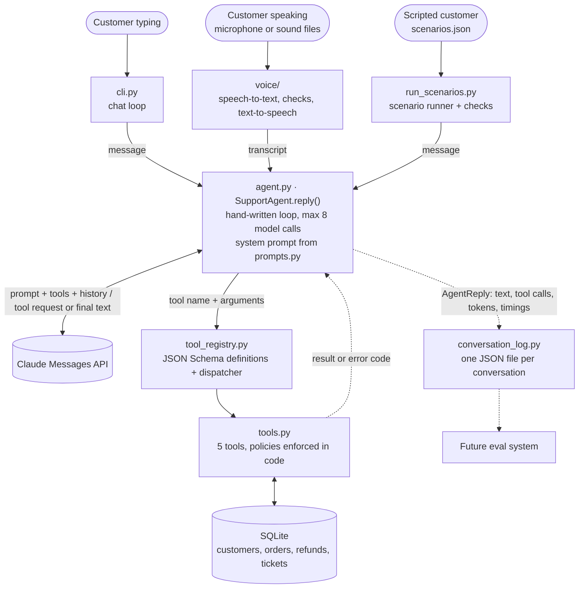
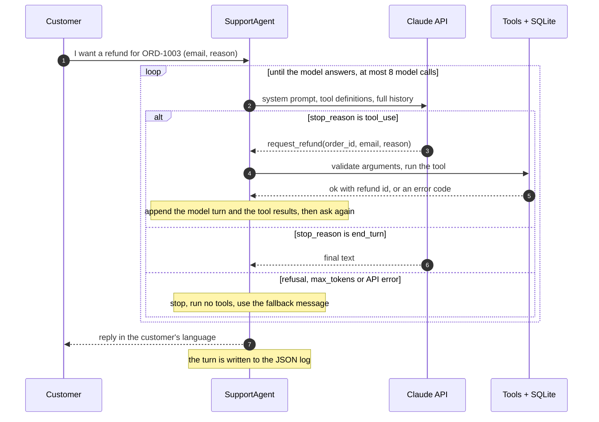
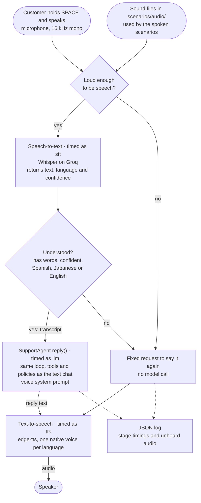

# Multilingual Support Agent

A customer support AI agent for a fictional online store, Kumo Market. It chats in Spanish, Japanese and English, and uses tools to look up orders, change shipping addresses, request refunds, open support tickets and hand a conversation to a human.

It works as a text chat and as a push-to-talk voice chat. Both are the same agent: voice only adds speech-to-text in front of it and text-to-speech behind it.

The agent loop is written by hand on top of the Claude API, with no agent framework, so every step is visible in about 250 lines of Python: the model decides, a tool runs, the result goes back, and it repeats until there is an answer.

```text
You> 注文ORD-1004のモニターを返金してほしいです。メールはken.sato@example.jpです。画面にドット抜けがあります。
  [tool] request_refund {"order_id": "ORD-1004", "email": "ken.sato@example.jp", "reason": "The monitor has dead pixels on the screen."} -> error: refund_window_expired
  [2 model call(s), 5.1 s, 5093 tokens in / 313 out, stop: end_turn]
Agent> ご連絡ありがとうございます。ドット抜けがあるとのこと、ご不便をおかけして申し訳ありません。

ORD-1004を確認したところ、お届けから45日が経過しており、返金のお申し込み期限(お届けから30日、2026年9月21日)を過ぎているため、返金をリクエストすることができませんでした。

私のほうでは期限の例外を設けることはできませんが、ご希望でしたら担当スタッフに引き継ぎ、状況を確認してもらうことができます。引き継ぎを希望されますか?
```

The customer writes in Japanese, the internal refund reason is recorded in English for the support team, the 30-day policy is enforced by the tool rather than by the model, and the agent offers a human instead of promising an exception.

## What it does

- **Answers in the customer's language** (Spanish, Japanese or English) and follows them if they switch.
- **Verifies identity** with order number plus email before sharing or changing anything about an order.
- **Acts through five tools** backed by a simulated SQLite store, each with its policy check in code.
- **Refuses what policy does not allow** (late refunds, address changes after shipping) and does not promise exceptions.
- **Escalates to a human** when the customer asks, is very upset, or the tools do not cover the case.
- **Logs every conversation as structured JSON**: messages, tool calls with arguments and results, token usage and latency. The logs are designed as input for an evaluation system.
- **Ships with ten scripted scenarios** that run against the live API and report what happened, as text and as speech.
- **Talks as well as types.** In the voice chat you hold a key, speak, and hear the answer. Speech-to-text and text-to-speech are free services, so voice adds no cost.
- **Is careful with what it hears.** On a call it says order numbers and emails back before using them, and asks the customer to repeat when a recording is silence, noise or unintelligible.
- **Measures its own latency**: every spoken turn is timed stage by stage.

## Architecture



The model never touches the database. It can only ask for a tool by name with arguments; the Python code decides whether and how to run it. It never touches sound either: the voice chat hands it a transcript and reads its answer aloud (see [Voice channel](#voice-channel)).

### One customer message, step by step



`SupportAgent.reply()` in [`support_agent/agent.py`](support_agent/agent.py) is that loop:

1. Send the full conversation, the system prompt and the tool definitions to the model. The API is stateless, so the history list is the agent's only memory.
2. If the model stops with `tool_use`, run every requested tool, append the model's turn and one message with all the results, and go back to step 1.
3. If it stops with `end_turn`, its text is the reply.
4. Anything else (`refusal`, `max_tokens`, an API failure, or reaching the iteration limit) ends the turn with a fixed fallback message, and no tool from an incomplete turn is ever run.

## Tools and policies

| Tool | What it does | Policy enforced in code |
| ---- | ------------ | ----------------------- |
| `get_order_status(order_id, email)` | Order status, dates, items and total | Email must match the order |
| `update_shipping_address(order_id, email, new_address)` | Changes the delivery address | Only while the order is `processing` |
| `request_refund(order_id, email, reason)` | Opens a refund request | Delivered orders, within 30 days of delivery, once per order |
| `create_support_ticket(email, summary)` | Opens a ticket for follow-up by email | Valid email required |
| `escalate_to_human(reason)` | Queues the conversation for a human agent | A reason is required |

Tools never raise for expected problems. They return `{"ok": false, "error_code": "...", "message": "..."}` with a stable code such as `order_not_found`, `email_mismatch`, `order_already_shipped` or `refund_window_expired`, so the model can explain the problem and the logs record exactly what happened.

## Getting started

Requires Python 3.10 or newer and an Anthropic API key. The voice chat also needs a free Groq API key, a microphone and Windows.

```bash
python -m venv .venv
.venv\Scripts\activate          # Windows
# source .venv/bin/activate     # macOS / Linux
pip install -r requirements.txt
cp .env.example .env            # then add your ANTHROPIC_API_KEY
python -m support_agent.seed    # build the simulated store database
```

### Configuration

Everything is read from `.env`, which is git-ignored.

| Variable | Description |
| -------- | ----------- |
| `ANTHROPIC_API_KEY` | Your Anthropic API key. Never commit it. |
| `ANTHROPIC_MODEL` | Claude model the agent uses. The code never names a model; a test enforces it. |
| `ANTHROPIC_EFFORT` | Optional thinking effort (`low` to `max`). Empty uses the API default. |
| `AGENT_MAX_ITERATIONS` | Optional cap on model calls per customer message (default 8). |
| `GROQ_API_KEY` | Voice only. Free Groq key for speech-to-text (no card needed). |
| `STT_MODEL` | Voice only. Speech-to-text model hosted by Groq. |
| `TTS_VOICE_ES`, `TTS_VOICE_JA`, `TTS_VOICE_EN` | Voice only, optional. Replace the default text-to-speech voice of a language. |
| `VOICE_SILENCE_LEVEL` | Voice only, optional. Recordings quieter than this are treated as silence (default 200). |

### Chat

```bash
python -m support_agent
```

```text
You> Hi, I'd like a refund for the headphones I bought.
  [1 model call(s), 2.3 s, 2403 tokens in / 27 out, stop: end_turn]
Agent> I can help with that. Could you please give me your order number and the email address you used for the order?

You> The order is ORD-1003 and my email is emily.johnson@example.com. The right ear cup stopped working after a week.
  [tool] request_refund {"order_id": "ORD-1003", "email": "emily.johnson@example.com", "reason": "The right ear cup of the headphones stopped working after one week."} -> ok
  [2 model call(s), 4.7 s, 5141 tokens in / 223 out, stop: end_turn]
Agent> I'm sorry the headphones stopped working. I've opened a refund request for order ORD-1003.

Reference number: RF-0001
Amount: 199.00 USD

Our support team will review the request. I can't promise it will be approved or say when any money would arrive. Is there anything else I can help with?
```

The indented lines show what happened behind each reply: tool calls with their arguments and outcome, then model calls, time and tokens.

| Option | Effect |
| ------ | ------ |
| `--quiet` | Hide the tool, timing and token lines |
| `--reset-db` | Rebuild the simulated store first (order dates are relative to the day it is built) |
| `--log-dir PATH` | Save conversation logs somewhere other than `logs/` |

Inside the chat, `/new` starts a fresh conversation and `/exit` leaves.

Orders with a known state, useful for trying things out (all created by the seed script):

| Order | Email | State |
| ----- | ----- | ----- |
| `ORD-1001` | `yuki.tanaka@example.jp` | Processing (address can change) |
| `ORD-1002` | `maria.garcia@example.com` | Shipped |
| `ORD-1003` | `emily.johnson@example.com` | Delivered 10 days ago (refundable) |
| `ORD-1004` | `ken.sato@example.jp` | Delivered 45 days ago (refund window closed) |
| `ORD-1005` | `carlos.hernandez@example.com` | Cancelled |

### Voice chat

```bash
python -m support_agent --voice
```

Hold SPACE while you talk and release it to send. The answer is printed and read aloud. `N` starts a new conversation, `Q` or `Esc` leaves, and `--quiet`, `--reset-db` and `--log-dir` work as in the text chat.

It needs a microphone, an internet connection, `GROQ_API_KEY` and `STT_MODEL` in `.env`, and Windows. How it works, how fast it is and how it is tested are described under [Voice channel](#voice-channel).

### Unit tests

```bash
pytest
```

268 tests, no API key, microphone or network needed: the agent, the chat and the scenario runner are tested against a scripted fake client, and the tools against a small hand-written store.

## Voice channel

The voice chat is a second interface around the same `SupportAgent`. Nothing about the tools, the policies or the loop is duplicated: sound is turned into the text the agent reads, and the agent's text is turned back into sound.



1. **Record.** The microphone records while SPACE is held. The spoken scenarios feed sound files into the same place.
2. **Check and transcribe.** A recording too quiet to be speech is never transcribed. Otherwise Whisper returns the text, the language and how confident it was, and the transcript is rejected if it has no words, was a guess, or is in a language the agent does not support.
3. **Answer.** The transcript goes to `SupportAgent.reply()`, exactly as a typed message would, with the voice version of the system prompt.
4. **Speak.** The reply is read by a voice native to the language the customer is speaking.

The code for steps 2 to 4 is [`support_agent/voice/pipeline.py`](support_agent/voice/pipeline.py); the key, the microphone and the speaker are in [`chat.py`](support_agent/voice/chat.py) next to it.

### What changes on a call

The store policies in the system prompt are word for word the same as in the text chat; a test checks it. Three parts of the prompt are different, because the model reads a transcript and writes for a voice:

- **It writes for the ear.** Short conversational answers, no Markdown or lists, dates and amounts in words, and codes spelled out one character at a time ("O, R, D, one, zero, zero, two") in the language being spoken.
- **It expects a faulty transcript.** An order number may arrive as `ORD1002` and an email without its `@`. The agent works out the written form before using it.
- **It confirms before acting.** It says back the order number, the email or a new address and waits for a yes before calling a tool. Handing over to a human is the exception: an upset customer is not asked to confirm digits first.

```text
You> Hola, ¿me pueden decir cómo va mi pedido ORD-1002? Mi correo es maria.garcia.example.com.
  [1 model call(s), 2.0 s, 3190 tokens in / 74 out, stop: end_turn]
Agent> Claro, con gusto la ayudo. Entendí que el pedido es O, R, D, uno, cero, cero, dos, y que su correo es maria punto garcia arroba example punto com. ¿Es correcto?
  [waited 7.0 s: speech-to-text 3.0 s, agent 2.0 s, text-to-speech 1.9 s]

You> Sí, es correcto.
  [tool] get_order_status {"order_id": "ORD-1002", "email": "maria.garcia@example.com"} -> ok
  [2 model call(s), 3.0 s, 6844 tokens in / 164 out, stop: end_turn]
Agent> Su pedido ya fue enviado. Salió el dos de octubre y todavía no se ha entregado. Incluye unos auriculares inalámbricos, y tiene un número de seguimiento que puedo leerle si quiere.
  [waited 6.3 s: speech-to-text 0.8 s, agent 3.0 s, text-to-speech 2.4 s]
```


The `You>` line is what the speech recogniser understood, mistakes included: here the email lost its `@`. The `[waited ...]` line is how long the customer waited, split by stage.

### When the customer is not understood

Speech recognition fails in ways typing never does, and it fails silently: given a silent recording, Whisper returned a confident "Thank you.", and a short Spanish "Sí." came back as an English "C.". So the decision is made in code, before the model sees anything:

| Problem | How it is detected | Logged as |
| ------- | ------------------ | --------- |
| Silence or a quiet room | The loudest moments of the recording are under `VOICE_SILENCE_LEVEL`. Speech-to-text is not called. | `silence` |
| Noise | The transcript has no letters or digits. | `no_words` |
| A guess | Whisper's own confidence is below its usual threshold. | `low_confidence` |
| Another language | Whisper reports a language other than the three supported. In the middle of a conversation it is transcribed once more as the conversation's language first. | `unsupported_language` |
| Service failure | The speech-to-text request failed. | `stt_error` |

In every case the agent asks the customer to say it again with a fixed spoken message, in the language of the conversation, or in all three before that language is known. It costs no model call, stays out of the agent's history, and is recorded in the log as an `unheard_audio` event. Recordings shorter than three seconds ("yes", "no") are transcribed in the language the conversation is already in, which is what fixes the "Sí." case.

If your own voice is rejected as too quiet, the chat prints the level it measured: lower `VOICE_SILENCE_LEVEL` in `.env`.

### Measured latency

Every spoken turn is timed and the times are saved in its log (`voice.timings_ms`): `stt`, `llm` (every model call and tool call of the turn), `tts`, and `total`, which runs from the end of the recording until the reply is ready to play. That total is how long the customer waits in silence.

| Stage | Average | Worst case | Share of the wait |
| ----- | ------: | ---------: | ----------------: |
| Speech-to-text (Whisper on Groq) | 2.10 s | 5.69 s | 28% |
| Agent (model + tools) | 2.84 s | 5.46 s | 38% |
| Text-to-speech (edge-tts) | 2.45 s | 5.82 s | 33% |
| **Total wait** | **7.39 s** | **12.81 s** | |

| Language | Turns | Speech-to-text | Agent | Text-to-speech | Total wait | Worst total |
| -------- | ----: | -------------: | ----: | -------------: | ---------: | ----------: |
| English | 9 | 2.58 s | 2.66 s | 1.94 s | 7.19 s | 10.02 s |
| Spanish | 10 | 1.99 s | 2.44 s | 2.34 s | 6.78 s | 12.81 s |
| Japanese | 8 | 1.68 s | 3.55 s | 3.15 s | 8.39 s | 12.21 s |

Measured on 2026-10-07 over the 27 turns of one run of the spoken scenarios below: `claude-sonnet-5-5` at `medium` effort, `whisper-large-v3-turbo` on Groq's free tier, `edge-tts`, from a home connection. One run is a small sample, so read it as an order of magnitude.

What the numbers say:

- **The wait is about seven seconds and no single stage is to blame.** Each takes two to three seconds, so making one of them instant would still leave a five-second pause.
- **Using a tool costs a second model call.** Turns with a tool call took 3.9 s in the agent on average, against 2.5 s for turns without one.
- **Replies are long to listen to.** The customer spoke for 6.4 s on average and the reply lasted 16.5 s, mostly because codes are spelled out. That is listening time, on top of the wait.
- **Japanese is the slowest**, in the agent and in text-to-speech.
- **The worst cases come from the free services**, which now and then take five seconds for something that usually takes one or two.

To measure your own conversations:

```bash
python -m support_agent.latency_report            # every log under logs/
python -m support_agent.latency_report PATH ...   # these log files or folders
```

It prints the same tables as text, plus the slowest turn and the log it is in.

### Spoken scenarios (no microphone)


Every customer line of [`scenarios/scenarios.json`](scenarios/scenarios.json) also exists as a sound file in [`scenarios/audio/`](scenarios/audio/), read once by a text-to-speech voice. A script sends them through the real pipeline: speech-to-text, the agent on a freshly seeded store, text-to-speech.

```bash
python -m support_agent.run_voice_scenarios                    # all ten
python -m support_agent.run_voice_scenarios es_order_status    # only these
python -m support_agent.run_voice_scenarios --play             # also hear both sides
python -m support_agent.run_voice_scenarios --list             # the spoken lines
python -m support_agent.run_voice_scenarios --make-audio       # regenerate the sound files
```

A spoken scenario has more turns than the written one: after the customer gives an order number or an email, the agent reads it back, and the script answers "yes, that's right" (`voice_confirm_after` in the scenarios file says where). The checks are the ones of the text scenarios plus three for voice:

- every customer line was understood;
- every reply was turned into speech;
- no order number or email was used with a tool before the customer confirmed it.

```text
RESULT SCENARIO                                TOOLS (in order)
PASS   es_order_status                         get_order_status:ok
FAIL   ja_address_change                       -
PASS   en_refund_in_window                     request_refund:ok
PASS   ja_refund_window_expired                -
PASS   es_address_change_after_shipping        update_shipping_address:error
PASS   en_someone_elses_order                  get_order_status:error
PASS   es_asks_for_human                       escalate_to_human:ok
PASS   ja_upset_customer                       escalate_to_human:ok
PASS   en_cancel_order_not_supported           create_support_ticket:ok
FAIL   es_wrong_order_number_then_corrected    -
------------------------------------------------------------------------------
8 of 10 scenarios passed. 34 model calls, 7 tool calls, 77 s, 114413 tokens in / 4190 out.
```

The confirmation check passed in all ten. The two failures are the speech recogniser losing an email, and they show both the value and the limit of this kind of test:

- `ja_address_change`: `yuki.tanaka@example.jp` was heard as `き.tanaka.example.jp`.
- `es_wrong_order_number_then_corrected`: the sentence with the email was dropped from the transcript altogether.

Both times the agent noticed, did not guess, and asked for the email again, which is the behaviour the confirmation rule is there for. A scripted customer cannot repeat or spell anything, so the conversation ends there. One pass is also weaker than it looks: in `ja_refund_window_expired` the agent was still confirming the email when the script ran out, so the refund was never attempted and "the refund never succeeded" was true by default.

The run ends with the latency table shown above, measured over every spoken turn. A full run costs roughly $0.10 to $0.15 of Claude usage, depending on how much of the prompt is cached; the speech services are free.

## Conversation logs

Every conversation is saved to `logs/<timestamp>_<id>.json` and rewritten after each turn. The format is meant for automated evaluation:

```jsonc
{
  "schema_version": 1,
  "conversation_id": "20261006T191317Z_10dd59f6",
  "channel": "text",                    // how the customer reached the agent
  "model": "...", "effort": "medium", "max_iterations": 8,
  "system_prompt_sha256": "...",        // which prompt version produced this conversation
  "metadata": {},                       // free-form labels, e.g. a scenario name and its check results
  "totals": { "turns": 2, "model_calls": 3, "tool_calls": 1, "latency_ms": 8058, "usage": { ... } },
  "turns": [
    {
      "index": 1,
      "user_message": "...",
      "assistant_message": "...",
      "stop_reason": "end_turn",        // or max_iterations, refusal, max_tokens, api_error...
      "completed": true,
      "iterations": 2,
      "latency_ms": 4669,
      "usage": { "input_tokens": 6, "output_tokens": 277, "cache_creation_input_tokens": 301, "cache_read_input_tokens": 4880 },
      "error": null,
      "model_calls": [ { "iteration": 1, "stop_reason": "tool_use", "latency_ms": 1616, "usage": { ... } } ],
      "tool_calls": [
        { "iteration": 1, "id": "toolu_...", "name": "request_refund",
          "input": { "order_id": "ORD-1007", "email": "...", "reason": "..." },
          "result": { "ok": true, "refund_id": "RF-0001", "status": "requested" },
          "is_error": false, "latency_ms": 19 }
      ],
      "voice": null                     // typed turn; a spoken turn looks like this:
      // "voice": { "language": "es", "detected_language": "es",
      //            "recording_seconds": 10.06, "speech_seconds": 17.45,
      //            "timings_ms": { "stt": 1306, "llm": 5616, "tts": 1295, "total": 8222 } }
    }
  ],
  "events": [                           // outside any turn, e.g. audio nobody understood
    { "type": "unheard_audio", "after_turn": 1, "reason": "silence", "level": 68, ... }
  ],
  "transcript": [ ... ]                 // raw message history exactly as sent to the API
}
```

## Scenario tests

[`scenarios/scenarios.json`](scenarios/scenarios.json) holds ten scripted conversations. Each one is a list of customer messages plus a few expectations, and runs against the live API on a freshly seeded in-memory store.

| Scenario | Language | What it covers |
| -------- | -------- | -------------- |
| `es_order_status` | es | Happy path: order lookup |
| `ja_address_change` | ja | Happy path: address change before shipping |
| `en_refund_in_window` | en | Happy path: refund 10 days after delivery, details given in a second message |
| `ja_refund_window_expired` | ja | Out of policy: refund 45 days after delivery, then asking for an exception |
| `es_address_change_after_shipping` | es | Out of policy: address change after the order shipped |
| `en_someone_elses_order` | en | Privacy: another customer's order, then "it's my wife's order" |
| `es_asks_for_human` | es | Escalation: the customer asks for a person |
| `ja_upset_customer` | ja | Escalation: a very upset customer who did not ask for a person |
| `en_cancel_order_not_supported` | en | A request no tool covers (cancelling an order) |
| `es_wrong_order_number_then_corrected` | es | Recovery: a wrong order number, then the right one |

```bash
python -m support_agent.run_scenarios                    # run all ten
python -m support_agent.run_scenarios en_someone_elses_order
python -m support_agent.run_scenarios --list
```

The runner prints every conversation with its tool calls, then a summary, and exits with a non-zero code if any check failed. This is the summary of a run with `claude-sonnet-5-5` at `medium` effort:

```text
RESULT SCENARIO                                TOOLS (in order)
PASS   es_order_status                         get_order_status:ok
PASS   ja_address_change                       get_order_status:ok, update_shipping_address:ok
PASS   en_refund_in_window                     request_refund:ok
PASS   ja_refund_window_expired                request_refund:error
PASS   es_address_change_after_shipping        update_shipping_address:error
PASS   en_someone_elses_order                  get_order_status:error
PASS   es_asks_for_human                       escalate_to_human:ok
PASS   ja_upset_customer                       get_order_status:ok, escalate_to_human:ok
PASS   en_cancel_order_not_supported           get_order_status:ok, create_support_ticket:ok
PASS   es_wrong_order_number_then_corrected    get_order_status:error, get_order_status:ok
------------------------------------------------------------------------------
10 of 10 scenarios passed. 31 model calls, 14 tool calls, 73 s, 82907 tokens in / 3764 out.
```

That run cost about $0.12 at list prices. Logs for each run go to `logs/scenarios/<run id>/`, with the scenario id and check results in each log's `metadata`, plus a `summary.json`.

The checks are deliberately narrow. They only look at facts that are unambiguous in the record:

- `must_succeed` / `must_succeed_one_of`: a tool had a successful call.
- `must_not_succeed`: a tool never succeeded. Failed attempts are fine, because the policy check lives in the tool.
- `must_not_say`: a string never appears in a reply, used to detect leaked order details.
- Every turn ended normally (no iteration limit, refusal or API error).

They do not judge language, tone or whether an explanation was accurate. A model is not deterministic either, so one green run is evidence, not proof. Both gaps are what a proper eval suite is for.

## Design decisions and trade-offs

**A hand-written loop instead of a framework.** The goal was to understand the mechanism, and the loop turned out to be small. The cost is owning details a framework or the SDK's tool runner would handle: stop reasons, pairing each tool result with its request, keeping the history well-formed after a failure.

**Policies are enforced in the tools, and only explained in the prompt.** A model can misread a rule or be talked out of it; a date comparison cannot. Even if a customer persuades the agent to try, `request_refund` rejects a 45-day-old order. The cost is that each policy lives in two places, the tool code and the prompt text, which have to be kept in sync by hand.

**Tool failures are results, not exceptions.** Expected problems come back as `{"ok": false, "error_code": ...}`, so the model can explain them and an eval can assert on the exact code. Unexpected bugs inside a tool are caught by the dispatcher and reported the same way, so one bad call cannot end a conversation.

**The model only sees the arguments in the schema.** Tool definitions use strict JSON Schemas, and the dispatcher rejects any call whose arguments differ from them. That keeps internal parameters, such as the injectable clock the tests use, out of the model's reach.

**One answer for "order not found" and "email does not match".** The tools return different error codes, and the logs keep them, but the prompt tells the agent to say only that the details could not be verified. Someone guessing order numbers learns nothing, at the price of a slightly less helpful message for an honest typo.

**The reply language and the internal language are separate.** The agent answers in the customer's language but writes ticket summaries, escalation reasons and refund reasons in English, on the assumption of an English-speaking support team. It also makes logs comparable across languages.

**The model and its settings come from the environment.** No model name appears in the code, and a unit test fails if one does. Changing model is a one-line edit in `.env`, although request options such as strict tools, prompt caching and effort are not accepted by every model.

**Prompt caching is on.** The system prompt and tool definitions are identical on every call, and each call of the loop resends the whole history. In the scenario run above, 65% of input tokens were cache reads, which brought the cost from about $0.20 to $0.12.

**The history is append-only and model turns are stored unchanged**, thinking blocks included, as the API requires for current models. There is no trimming or summarising, so a very long conversation costs more on every turn.

**The agent does not know how the customer reaches it.** `SupportAgent.reply()` takes text and returns text plus a record of what happened. The few things that depend on the channel (three parts of the prompt: the setting, how to handle order numbers and other exact values, and the style; plus the fallback message) are bundled in a `Channel` object handed to the agent. The text chat and the voice chat reuse the same loop, tools and policies without copying them. The cost is one more concept to follow, and a prompt assembled from parts instead of read top to bottom in one place.

**Stopping is always safe.** The loop has an iteration limit. When it stops without an answer, for any reason, the customer gets a fixed message in all three languages, since the model is not available to translate it. Tools from a truncated or refused turn are never run, because their arguments may be incomplete. API failures become a reply with `stop_reason: "api_error"` rather than an exception, so the turn is still logged along with any tool that had already run.

**Logs are rewritten in full after every turn.** One readable JSON file per conversation, safe against a crash mid-conversation, with a schema version and a hash of the system prompt. Rewriting the whole file is wasteful for long conversations, which is acceptable at this scale; an append-only format such as JSON Lines would suit high volume better.

**Seed data is relative to today.** Order dates are generated as "N days ago", so "delivered 10 days ago" stays true whenever the database is built, and eight hand-picked orders have a fixed, known state for demos and scenarios. Everything else comes from a fixed random seed.

**Tests never call the API.** Unit tests script a fake client, so they are free, fast and deterministic. They prove the loop's mechanics, not the model's behaviour; that is what the scenarios are for, and one real bug (the API client being created before `.env` was loaded) only appeared in a live run.

### Voice

**Three services in a row, not a speech-to-speech model.** Speech-to-text, the text agent, then text-to-speech. Everything built for the text chat is reused as it is, the logs stay readable text, and each stage can be measured and replaced on its own. The price is latency, since three network calls happen one after another, and the loss of everything in a voice that is not words: the agent cannot hear that a customer sounds upset, only read what they said.

**Free providers: Whisper on Groq and edge-tts.** The voice channel had to cost nothing, which ruled out the paid services compared at the start (OpenAI, ElevenLabs, Deepgram). Groq's free tier needs no card, answers in a second or two, and reports the language it heard. `edge-tts` gives a natural voice native to each of the three languages without an account. Its weakness is that it is unofficial: it talks to the service behind Microsoft Edge's "Read aloud", which can change without notice. That is why both providers sit behind two small interfaces (`SpeechToText`, `TextToSpeech`): replacing one means writing one class. Local replacements (Whisper on the CPU, the voices installed with Windows) were considered as fallbacks and not built.

**Push-to-talk instead of an open microphone.** The key says exactly when the customer starts and stops talking. That removes three hard problems at once: deciding when someone has finished a sentence and is not just pausing, keeping the agent's own voice from being recorded through the speaker, and sending background noise to the recogniser. The price is that it does not feel like a phone call: it needs a keyboard and a hand, and the customer cannot interrupt. Reading the release of a key also tied this version to Windows.

**The checks on what was heard are code, not prompt.** Whisper answers silence with confident text, so asking the model to "notice when the transcript looks wrong" would not work: it looks fine. Loudness, missing words, low confidence and unsupported languages are checked before the agent is called, and the request to repeat is a fixed message. It is instant, free and the same every time, at the cost of sounding less natural than a reply written for the moment.

**Confirmation is in the prompt, and verified by the scenarios.** Saying a value back before using it is behaviour, so it lives in the voice prompt, but a spoken scenario fails if a tool that takes an order number or an email runs before the customer has said yes. The cost is one extra exchange, about seven seconds, for something a typing customer never needs.

**Reading numbers aloud is left to the model.** The prompt asks for "O, R, D, one, zero, zero, two" and for dates and amounts in words, in the language being spoken. A text normaliser in code would be predictable, but it would need rules for three languages; the model already knows how each one says a date.

**The voice follows the customer's language, and short answers inherit it.** Each text-to-speech voice is native to one language, so the reply uses the voice of the language the recogniser reported. A one-word answer is too short to identify, so clips under three seconds are transcribed in the language of the conversation. A customer who switches language has to do it with a full sentence.

**Test audio is synthetic and committed.** The customer's lines are generated once with text-to-speech and stored in the repository with a manifest of the text each came from, so the spoken scenarios run without a microphone and a changed scenario is detected. Synthetic speech is clean: no accents, hesitations or background noise. The recogniser still lost two emails out of ten conversations.

## Known limitations

- **Everything behind the tools is simulated.** There are no payments, carriers or emails. A refund is a database row with status `requested`, a ticket is a row nobody reads, and no human is waiting behind `escalate_to_human`.
- **Escalation carries no contact details.** `escalate_to_human(reason)` stores only a reason. In the `es_asks_for_human` run the agent told a customer who had given no email or order number that a human would contact them. A real deployment would hand over the live chat session, or the tool would require a way to reach the customer.
- **Authentication is weak.** Anyone who knows an order number and its email can read the order, change its address and request a refund. Nothing in the code limits verification attempts; the prompt only asks the agent to offer a human after a couple of failures.
- **Robustness against manipulation is barely tested.** One scenario covers social engineering. Prompt injection, jailbreak attempts and adversarial inputs are untested. Tool-level policies limit the damage, but not the wording of replies.
- **The scenario checks are shallow and the sample is small.** Ten conversations, run once each, checked only for tool outcomes and forbidden strings. Whether the agent used the right language was verified by reading the transcripts, not by code.
- **Only one model configuration was exercised:** `claude-sonnet-5-5` at `medium` effort.
- **No streaming.** In the runs above the customer waited between 1 and 7 seconds per turn with no feedback.
- **No persistence or concurrency.** A conversation lives in memory and cannot be resumed; the chat serves one customer over one SQLite connection.
- **Refusals end the turn.** If the model declines to answer, the customer gets the fallback message. There is no retry on another model.
- **Logs hold personal data in plain text.** Emails and addresses typed by the customer are written to disk with no redaction or retention policy. `logs/` is git-ignored for that reason.
- **Three languages only, and no localisation.** Other languages and mixed-language messages are untested. Dates are shown in ISO format, amounts in USD, and the refund window is counted in UTC days.

### Voice

- **The customer waits about seven seconds for every answer**, and hears nothing meanwhile. Nothing is streamed: each stage finishes before the next one starts.
- **The agent cannot be interrupted.** Replies lasted 16 seconds on average, and the key is ignored until the audio ends.
- **Emails and addresses are fragile by voice.** In the spoken scenarios the recogniser lost an email twice, and a Japanese address "3-1-1" came back as "321". The agent asks again instead of guessing, but there is no better way to give an email than saying it again, such as spelling it letter by letter with a fixed alphabet.
- **Two of the ten spoken scenarios fail, and one passes by default**, for the reasons given above. A scripted customer can only say yes; it cannot repeat or spell.
- **Tested with synthetic voices only**, apart from informal use by one person. Accents, hesitations, noisy rooms and telephone-quality audio are untested.
- **The silence level is a fixed number**, set from one quiet room and never calibrated against real voices. A voice in the background that is loud enough, such as a television or another person, passes as the customer.
- **A language switch said in under three seconds is transcribed in the old language.** Languages other than the three supported are rejected with a request to repeat.
- **The speech services are free and best effort.** `edge-tts` is unofficial and may stop working; Groq's free tier limits how many requests can be made per minute and per day; both need an internet connection, and the customer's speech is sent to them.
- **Windows only**, and the microphone stays open for the whole chat (only what is said while the key is held is kept).
- **The voice prompt was tuned on the same ten scenarios it is tested with.** How it behaves on other requests is unknown.
- **Recordings are not stored**, only their transcripts. Good for privacy, but a recognition error cannot be re-examined later.

## Project structure

```
support_agent/
  agent.py             the hand-written loop (SupportAgent.reply)
  prompts.py           system prompt: shared store policies + per-channel setting and style
  channels.py          what depends on the channel (prompt, fallback message): text and voice
  tool_registry.py     tool definitions sent to the model + dispatcher
  tools.py             the five tools and their policy checks
  db.py, seed.py       SQLite schema and simulated data
  config.py            settings read from .env
  conversation_log.py  structured JSON log
  cli.py               entry point and terminal chat
  voice/               push-to-talk voice chat: microphone, speech-to-text, text-to-speech,
                       the checks on what was heard, and the spoken scenarios
  scenarios.py         scenario loading, checks and execution
  run_scenarios.py     scenario runner
  latency_report.py    average and worst-case latency per voice stage, from the logs
  run_voice_scenarios.py  the scenarios as speech, through the whole voice pipeline
scenarios/             the ten scripted conversations
  audio/               their customer lines as sound files, plus a manifest
tests/                 unit tests (no API calls, microphone or network)
data/                  SQLite database (generated, not committed)
logs/                  conversation logs (generated, not committed)
```

## Next steps

**Streaming, to cut the wait.** Today each stage waits for the previous one to finish. The model's answer could be streamed and sent to text-to-speech sentence by sentence, so the first sentence starts playing while the rest is still being written; text-to-speech can stream its audio the same way, and a streaming recogniser can transcribe while the customer is still talking. The wait would shrink from the sum of the three stages to roughly the time until the first sentence is ready.

**Barge-in: letting the customer interrupt.** A person on a call cuts in when they have heard enough. That needs the microphone open while the agent speaks, voice activity detection to notice the customer, echo cancellation so the agent does not hear itself, and a way to stop playback and tell the model how much of its answer was actually heard. It would replace push-to-talk.

**A real phone line.** Connecting the pipeline to a telephony provider, so a customer can simply call a number. Phone audio is narrower and noisier than a laptop microphone, turns have to be detected without a key, and the keypad becomes an option for exactly the data that voice handles worst: an order number can be typed instead of dictated.

**An evaluation system built on the conversation logs.** More scenarios, repeated runs to measure variance, and graders for what the current checks cannot see: language adherence, accuracy of explanations, tone, and for voice, how often the read-back matched what the customer actually said.

Smaller things the measurements point to: trying a lower thinking effort for voice, where every second is heard; a customer in the spoken scenarios that can repeat and spell; and a local speech-to-text and text-to-speech fallback for when the free services are down.

## License

[MIT](LICENSE). The store, its customers and its orders are fictional, and the sound files in `scenarios/audio/` are synthetic voices.
